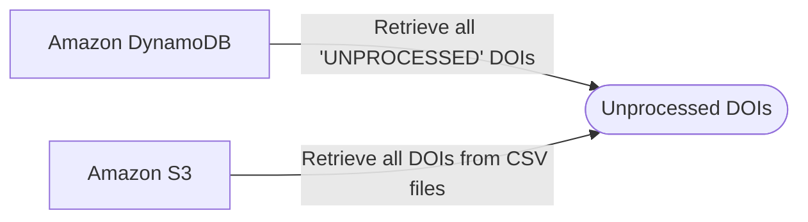
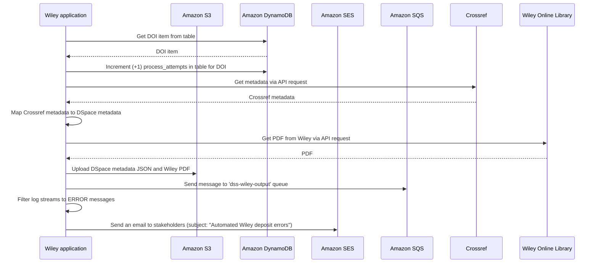
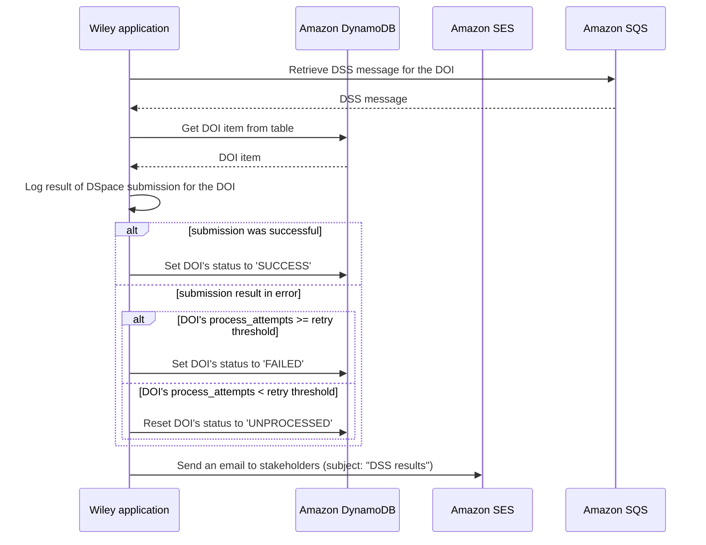

# wiley-deposits


## `deposit`

### Retrieval of Unprocessed DOIs

This flowchart describes the sources of the DOIs that are processed by the Wiley `deposit` workflow.



### Processing of DOIs

This sequence diagram depicts the processing workflow for a single DOI when the application's `deposit` command is run. 



## `listen`

### Processing of DSS messages
This sequence diagram depicts the processing workflow for a single message from the [dspace-submission-service](https://github.com/MITLibraries/dspace-submission-service/tree/main) when the application's `listen` command is run.




## Installation

To install, clone the repo and run 

```
pipenv run install 

```

To install with development dependencies

```
pipenv run install --dev
```

## Runnning commands

To excute a command after installation, run:

```
pipenv run awd deposit
```

The available commands:

`deposit` - Process a text file of DOIs to retrieve and send metadata and PDFs as SQS messages to the DSpace Submission Service. Errors generated during the process are emailed to stakeholders.

`listen` - Retrieve messages from a DSpace Submission output queue and email the results to stakeholders.

## Crossref to Dublin Core metadata mapping
Metadata is retrieved from the Crossref API and is mapped to Dublin Core according to this crosswalk:

Crossref field|DC field|Field notes
------ | ------ | -------
author|dc.contributor.author|Multiple values possible, create separate field instances for each value. Names concatenated as Family, Given.
container-title|dc.relation.journal|
ISSN|dc.identifier.issn|Multiple values possible, create separate field instances for each value.
issue|mit.journal.issue|
issued|dc.date.issued|
language|dc.langauge|
original-title|dc.title.alternative|
publisher|dc.publisher|
short-title|dc.title.alternative|
subtitle|dc.title.alternative|
title|dc.title|
URL|dc.relation.isversionof|
volume|mit.journal.volume|