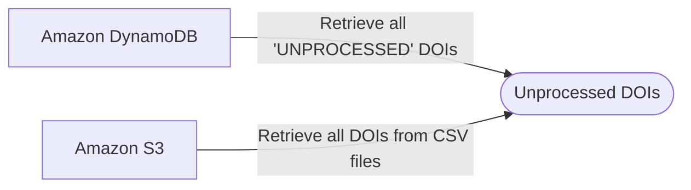
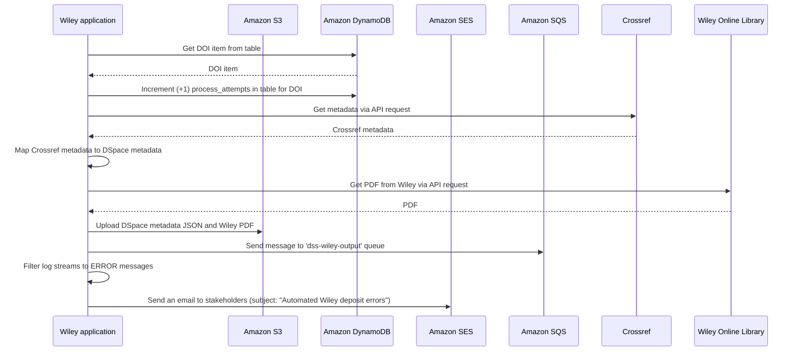
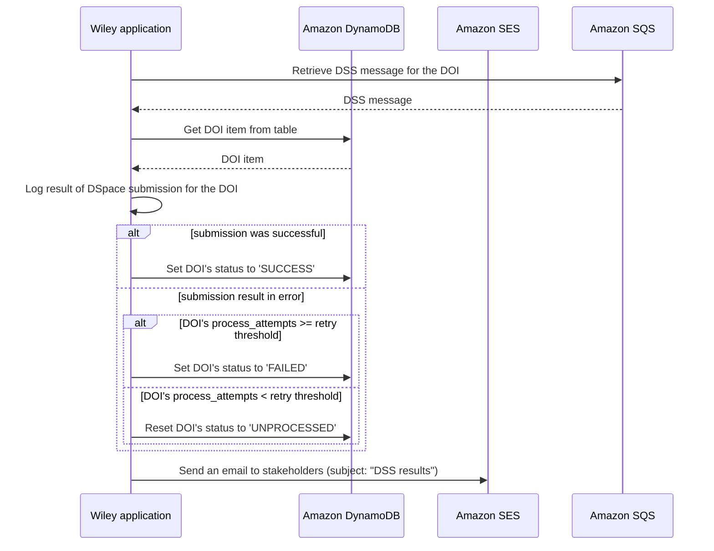

## The `deposit` command

### Retrieval of Unprocessed DOIs

This flowchart describes the sources of the DOIs that are processed by the Wiley `deposit` workflow.

### Processing of DOIs

This sequence diagram depicts the processing workflow for a single DOI when the application's `deposit` command is run. 

## The `listen` command

### Processing of DSS messages
This sequence diagram depicts the processing workflow for a single message from the [dspace-submission-service](https://github.com/MITLibraries/dspace-submission-service/tree/main) when the application's `listen` command is run.

